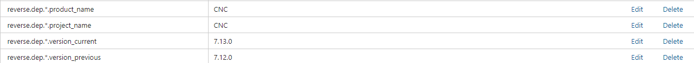
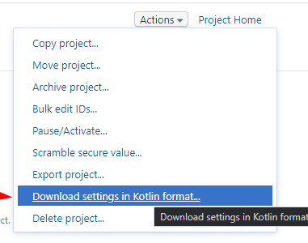
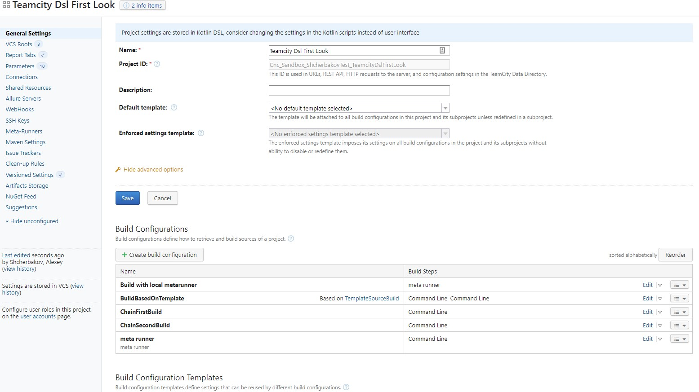

<!-- _class: cover -->

# Configuration as code: Teamcity. Первое знакомство

## Обо мне

<!-- _footer: test -->

<div class="columns">


Меня зовут Алексей.
Последние 5 лет в ролях тестировщика-автоматизатора, фронтенд разработчика и управленца (тех.лид, тимлид).
В рамках разных проектов, но одной крупной компании.
От стажёра до ведущего инженера.

</div>

## Teamcity vs Другие CI

Исторически так сложилось, что Teamcity в отличии от TravisCI и ему подобных не позволял работать с конфигурацией без UI.

Но шло время, сборки становились всё более изощрёнными:

- шаблонные сборки
- мета-раннеры
- pipeline с реверсивными зависимостями

Начиная с Teamcity 10 версии появился программный способ настройки конфигурации.

DSL построенный на основе продвигаемого Jetbrains языка Kotlin, а в версии 2018.x DSL довели до промышленного состояния, покрыв оставшиеся кейсы конфигурирования.

Само версионирование представляет собой двухсторонний биндинг конфигурации Teamcity server и конфигурации под контролем системы контроля версий.

## Форматы версионирования настроек Teamcity

Доступные на момент эксплуатации версии Teamcity 2021.2

|                        | KotlinDSL | xml(plain) |
| ---------------------- | --------- | ---------- |
| переносимость          | ✅        | ❌         |
| гибкость               | ✅        | ❌         |
| расширяемость          | ✅        | ❌         |
| обратная совместимость | ✅        | ✅/❌      |

<!-- Пример DSL конфигурации + представление её же ввиде xml -->

Стоит отметить, что

1. для работы с настройками в формате xml возможно добавить расширенные возможности. Это например проект Terraform Provider TeamCity. Но как пишет сам автор в своём мотивационном посте проект был сделан за долго до полноценной реализации конфигурирования через Kotlin DSL.

<!-- Пример конфигурации с использованием Terraform Provider -->

2. сравнение возможно немного не честное, т.к. в случае с Kotlin DSL мы пишем инструкции, а в случае с XML готовый артефакт конфигурации. Более правильно было-бы сравнивать Terraform Provider Teamcity и KotlinDSL
3. используя Kotlin DSL можно и нужно отказываться от шаблонных сборок, мета-раннеров в пользу расширения DSL.
4. никто не любит xml (ИМХО)

## Kotlin DSL

Как будет выглядеть сборка ввиде DSL можно посмотреть прямо в интерфейсе.
|интерфейс|dsl|
|---------|---|
|<><><><><>|<><>|


Справа у нас представление сборки из UI в Kotlin DSL

## Структура версионируемого проекта

```
.teamcity
[
--| pluginData
----| _Self
------| metaRunners
--------| matarunner.xml
]
[
--| patches
----| entities
]
--| pom.xml
[--| Readme.md]
--| settings.kts
```

обязательные:

- pom.xml
- settings.kts

## Типовые сущности и связи сущностей в представлении Teamcity DSL

1. Шаблонная сборка
2. pipeline из нескольких сборок
3. метараннеры
4. параметры сборки в DSL

<!-- Рассмотрим ряд типовых сущностей, с которыми вы наверняка сталкиваетесь. -->

## Шаблонная сборка. Teamcity DSL vs UI


## Шаблонная сборка. Регистрация шаблона в DSL


регистрация шаблона в settings.kts https://stash.billing.ru/projects/~alexey.shcherbakov/repos/teamcity-dsl-first-look/browse/.teamcity/settings.kts?at=355bc7dd0baedeb171627328c51109ec05adecc2#43

## Шаблонная сборка. Конфигурация шаблона


имплементация https://stash.billing.ru/projects/~alexey.shcherbakov/repos/teamcity-dsl-first-look/browse/.teamcity/settings.kts?at=355bc7dd0baedeb171627328c51109ec05adecc2#94

отличия от любой другой сборки

вместо BuildType( тут Template(
у шагов (steps) явно заданы ID

## Шаблонная сборка. Использование шаблона


использование https://stash.billing.ru/projects/~alexey.shcherbakov/repos/teamcity-dsl-first-look/browse/.teamcity/settings.kts?at=355bc7dd0baedeb171627328c51109ec05adecc2#80

отличия от любой другой сборки:

ссылка на шаблон
явное отключение шагов, заимствованных из шаблона по ID
Шаблонные конфигурации это legacy

Since DSL is a code in Kotlin programming language, all paradigms supported by this language are available. For instance, instead of using TeamCity templates, one can create a function or class which will encapsulate project common settings. For those who have programming skills it allows for more natural reuse of build configuration settings.

https://www.jetbrains.com/help/teamcity/kotlin-dsl.html#KotlinDSL-HowKotlinDSLWorks

## pipeline через зависимость артефактов


## pipeline через зависимость артефактов. Регистрация двух сборок


## pipeline через зависимость артефактов. Конфигурация первой сборки


Первая сборка

https://stash.billing.ru/projects/~alexey.shcherbakov/repos/teamcity-dsl-first-look/browse/.teamcity/settings.kts?at=355bc7dd0baedeb171627328c51109ec05adecc2#140

В результате работы будет создан артифакт сборки ChainFirstBuild.txt

## pipeline через зависимость артефактов. Конфигурация второй сборки


использование зависимости по артефакту от первой сборки во второй

https://stash.billing.ru/projects/~alexey.shcherbakov/repos/teamcity-dsl-first-look/browse/.teamcity/settings.kts?at=355bc7dd0baedeb171627328c51109ec05adecc2#169

## метараннеры в структуре проекта

```
.teamcity
--| pluginData
----| _Self
------| metaRunners
--------| matarunner.xml
```

metarunner.xml в файле settings.kts в poject явно никак не регистрируется

регистрация в проекте происходит за счёт размещения xml файла .teamcity/pluginData/\_Self/metaRunners/<runner_id>.xml

> можно править существующий в проекте (добавленный из UI), но не создавать новый в проекте. (по крайней мере у меня не вышло добавить мета-раннер из vcs)

<!-- _footer:  [подробнее про мета раннеры teamcity](https://www.jetbrains.com/help/teamcity/working-with-meta-runner.html#Creating+Meta-Runner+from+XML+Definition+of+Build+Configuration) -->

## использование метараннера в DSL


на строке 6 указан type = "<runner_id>", Т.е. Cnc_Sandbox_ShcherbakovTest_Metarunner - id метараннера

исходный код: https://stash.billing.ru/projects/~alexey.shcherbakov/repos/teamcity-dsl-first-look/browse/.teamcity/settings.kts?at=355bc7dd0baedeb171627328c51109ec05adecc2#134

## метараннер код


исходный код https://stash.billing.ru/projects/~alexey.shcherbakov/repos/teamcity-dsl-first-look/browse/.teamcity/pluginData/_Self/metaRunners/Cnc_Sandbox_ShcherbakovTest_MetaRunner.xml?at=355bc7dd0baedeb171627328c51109ec05adecc2#2

имплементация

в имплементации мета-раннеров нет изменений относительно использования в UI

> Метараннеры в контексте существования DSL - legacy. Xml зло.

## параметры сборки в DSL


код:

```
params {
    text("reverse.dep.*.version_previous", "7.12.0", label = "Предыдущая версия", display = ParameterDisplay.PROMPT,
          regex = """^(([1-9]\d*)\.(0|[1-9]\d*)\.(0|[1-9]\d*))${'$'}""", validationMessage = "Некорретный номер версии")
    select("reverse.dep.*.project_name", "CNC", label = "Компонент", display = ParameterDisplay.PROMPT,
            options = listOf("CNC", "CATALOG", "CORE", "CATALOG-UI"))
    text("reverse.dep.*.version_current", "7.13.0", label = "Текущая версия", display = ParameterDisplay.PROMPT,
          regex = """^(([1-9]\d*)\.(0|[1-9]\d*)\.(0|[1-9]\d*))${'$'}""", validationMessage = "Некорректный номер версии")
    param("reverse.dep.*.product_name", "CNC")
}
```

интерфейс:



Особенно примечательно это становится, когда сборки в chain и можно найти как и куда должен проливаться reverse.dep. Описание reverse.dep https://www.jetbrains.com/help/teamcity/predefined-build-parameters.html#Overriding+dependencies+Properties

## Варианты использования версионирования настроек. UI first

1. создание или изменение чего-то из интерфейса пользователем
2. teamcity делает коммит от пользователя на изменение сборки в проекте

## Варианты использования версионирования настроек. git first

1. коммит на изменение сборки от пользователя
2. применение изменений в teamcity

## Варианты использования версионирования настроек. Mixed (Git + UI)

1. коммит на изменение сборки от пользователя
2. применение изменений в teamcity
3. создание или изменение чего-то из интерфейса пользователем
4. teamcity делает коммит от пользователя с патчем на изменение сборки в проекте
5. применение патча от code owner репозитория или от пользователя как инициатора когда-нибудь

## Варианты использования версионирования настроек

| изменение / подход | git first | ui first | mixed (git + ui) |
| ------------------ | --------- | -------- | ---------------- |
| ui                 | ✅        | ❌       |
| code               | ✅        | ❌       |

## Как прийдётся трансформировать работу по конфигурированию


в варианте UI first практически никак.

во всех остальных (Git first, UI first):

- уменьшить количество пояснений и коммуникация по изменению конфигураций
- удалить все заметки - бэкапы сборок
- немного изучить Kotlin (однако даже javascript разработкик разобрался, так что согласно мемасикам из интернетов получится у любого, даже не программиста =) )
- относится к разработке конфигурации как и к любой другой разработке (все подходы к разработке станут ложиться на кофигурирование CI as is)

## Как попробовать фичу представления настроек в DSL


Уже сейчас достаточно зайти в любую сборку и нажать на кнопку View DSL

## Как попробовать фичу версионирования настроек

1. Создать свой, не пустой репозиторий
2. Создать Teamcity проект/подпроект
3. Включить версионирование проекта
4. Дождаться initial commit от teamcity в гит

## Как работать с Kolin DSL в intellij idea

1. Включены плагины maven, kotlin
2. Добавить проект в maven (пкм на pom.xml)
3. Выполнить install

> если у вас в организации используется локальное зеркало maven,
> то надо добавить искобчение для репозитория dsl

делается это путём внесения изменений в ваш конфигурационный файл для maven. Для пользователей windows путь примерно следующий:
`C:\Users\alexey.shcherbakov\.m2\settings.xml`

настройка (в секцию settings > mirrors)

```xml
...
<settings ...>
  <servers>
...
  </servers>
  <mirrors>
    <mirror>
      <mirrorOf>*,!jetbrains-all,!teamcity-server</mirrorOf>
      <name>maven</name>
      <url>https://${TEAMCITY_SERVER_URL}:${TEAMCITY_SERVER_PORT}/artifactory/maven</url>
      <id>maven</id>
    </mirror>
    ...
  </mirrors>
...
</settings>
```

## Начать переводить проект на версионирование настроек безопасно



скачать архив с настройками проекта через Actions > Download settings in Kotlin format

## Начать переводить проект на версионирование настроек безопасно. Init проекта


поместить содержимое скаченного архива в папку .teamcity репозитория

---

### Важно!<br>на всемя перехода чтобы не зааффектить существующие сборки рекомендуется выглючить триггеры, билд фичи

`regexp`

## создать проект teamcity


## создать проект на основе версионируемых настроек


Teamcity увидит ваш файл settings.kts

## создать подпроект на основе версионируемых настроек

Если вы создаёте подпроект в версионируемом проекте (как в моём случае), то будет необходимо "отчудить" новый подпроект от основного

после создания проекта заходим в подпроект

- там будет стоять Use settings from a parent project
- выбрать Synchronization enabled
- далее импортируем настройки

## Применение настроек из VCS

> импорт может занять продолжительное время в случае большого проекта



## 20/80 - UI first

1. Знакомство с конфигурацией
2. Откатов состояния конфигурации всего проекта до последнего рабочего
3. Анализ существующих сборок
4. Перенос сборки из одного проекта в другой методом копирования
