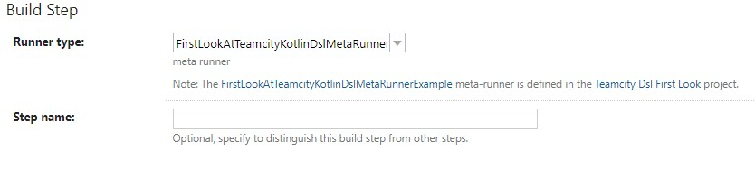

<!-- _class: cover -->

# Configuration as code: Teamcity. Первое знакомство

## Обо мне

<!-- _footer: GH: https://github.com/akaguny; Tg: https://t.me/alexey_shcherbakov -->

<div class="two-columns">


Меня зовут Алексей.
Последние 5 лет в ролях тестировщика-автоматизатора, фронтенд разработчика и управленца (тех.лид, тимлид).
В рамках разных проектов, но одной крупной компании.
От стажёра до ведущего инженера.

</div>

## Teamcity vs Другие CI

- Teamcity - UI first

<!--
...
в отличие от TravisCI, GithubActions и других Teamcity - UI first
...
это даёт низкий порог входа -
вам не надо изучать специфику экосистемы для того чтобы выполнить сборку условного npm пакета.
...
Пока звучит хорошо, даже отлично!
Но в чём подвох?
 -->


- Отлично!

<!-- _footer: Фото-постер: https://www.kinopoisk.ru/picture/430560/ -->

## Teamcity - про крупный enterprise

- шаблонные сборки
- мета-раннеры
- наследование
- pipeline
- параметры сборки
- аудит

<!--
Teamcity - про крупный enterprise
У вас будут десятки проектов с десятками сборок в каждом
В ходе работы вы наверняка столкнётесь с классическими проблемами
...
дублирование - teamcity предложит:
- шаблонные сборки
- мета-раннеры
- наследование
...
зависимости - teamcity предложит:
- pipeline и реверсивные параметры
...
кастомизацию поведения без изменения логики:
- параметры сборок
...
разбор ошибок и поиск ответственных
- аудит
 -->

## История Teamcity. Configuration as code


<!-- _footer: Фото <a href="https://upload.wikimedia.org/wikipedia/commons/thumb/f/fe/%D0%90%D1%80%D1%85%D0%B5%D0%BE%D0%BB%D0%BE%D0%B3%D1%96%D1%8F.JPG/1024px-%D0%90%D1%80%D1%85%D0%B5%D0%BE%D0%BB%D0%BE%D0%B3%D1%96%D1%8F.JPG">википедия</a> -->

## 2015 XML

[хранение настроек teamcity в системах контроля версий Teamcity 9.0](https://confluence.jetbrains.com/display/TCD9/What%27s+New+in+TeamCity+9.0#What'sNewinTeamCity9.0-StoringprojectsettingsinGitandMercurial)

<!-- cамо версионирование представляет собой биндинг конфигурации Teamcity server и конфигурации под контролем системы контроля версий. -->

## 2017-2018 Параллельная ветвь эволюции. Наработки сообщества

- XML отстой, Kotlin DSL ещё нет
- [Golang client for TeamCity REST API](https://github.com/cvbarros/go-teamcity) + [Terraform](https://www.terraform.io/) = [Terraform Provider for Jetbrains TeamCity CI server](https://github.com/cvbarros/terraform-provider-teamcity)

<!--
шёл 2017 и kolinDSL был ещё не готов
А что предложило сообщество спросите вы?
Сообщество предложило по сути свой DSL им стал Terraform Provider for Jetbrains TeamCity CI server

terraform provider по факту предоставляет тотже DSL, только применяет его в Teamcity через HTTP API Teamcity
 -->

<!-- _footer: .[Building Builds - TeamCity Pipelines as Code using Terraform](https://cvbarros.io/2018/11/building-builds---teamcity-pipelines-as-code-using-terraform/ )-->

## 2017 KotlinDSL

- [Teamcity DSL](https://confluence.jetbrains.com/display/TCD10/What%27s+New+in+TeamCity+10.0#What'sNewinTeamCity10.0-DSLforTeamCityProjectConfiguration)

- 

<!-- начиная с Teamcity 10 появилась возможность хранения и взаимодейтсвия с конфигурацией через KotlinDSL -->

## 2018 Portable KotinDSL

[Portable Teamcity DSL](https://confluence.jetbrains.com/display/TCD18/What%27s+New+in+TeamCity+2018.1#What'sNewinTeamCity2018.1-PortableKotlinDSLformat)

- settings.kts содержит конфигурацию целиком
- uuid и id для сущностей опциональны
- настройка версионирования проекта и настройки VCS не могут быть изменены из DSL

<!-- в версии 2018.x DSL довели до промышленного состояния, покрыв оставшиеся кейсы.
Добавили portable режим работы с DSL.
...
* при первом коммите настроек создаётся settings.kts содержит конфигурацию целиком
...
* uuid и id для сущностей опциональны
Больше нет необходимости зашиваться на идентификаторы
...
Но какие ограничения?
* настройка версионирования проекта и настройки VCS не могут быть изменены из DSL.
...
Также плохая новость состоит в том, что есть ряд сущностей, которые не попадают под общую концепцию и никогда не будут отражены в DSL в полной мере.
Но хорошая это то, что эти сущности могут быть представлены в DSL в привычном для него виде. Об этом позже, когда будем рассматривать шаблонные сборки и метараннеры.
 -->

## Наши дни. Teamcity 2021.2

|                        | KotlinDSL | xml(plain) |
| ---------------------- | --------- | ---------- |
| переносимость          | ✅        | ❌         |
| гибкость               | ✅        | ❌         |
| расширяемость          | ✅        | ❌         |
| обратная совместимость | ✅        | ✅/❌      |

- никто не любит xml
  <!--
  А что в настоящем?
  Вернёмся в 2021, последняя версия на момент рассказа доклада Teamcity 2021.2
  Как видно из таблички XML проигрывает по всем фронтам.
  ....
  Кроме того ИМХО конечно, но никто не любит XML
  -->

## Teamcity в действии. Кейсы UI vs Code

- 

<!-- _footer: мемчик: https://meme-arsenal.com/create/meme/6088503 -->

<!--
Как я говорил ранее Teamcity про интерпрайз, и как вы думаете на каких примерах я бууд показывать выгоды от использования конфигурации как кода?
Да, конечно на самых простых, уровня Hellow World =).
 -->

## Teamcity in action. Интерфейс. Общий вид

- 

<!--
Помните ли вы интерфейс Teamcity так как помню его я?
Не факт, поэтому предлагаю взглянуть на него.
В левой части разрезы настроек. Их действительно много, но хорошо то, что говорить мы будем лишь про некоторых их них.
 -->

## самый стандартный из всех типов шагов в Teamcity - command line


<!--
Основная настройка сборки это шаги сборки.

прежде чем говорить проабстракции посмотрим на самый стандарнтный из всех шаг сборки. Такой шаг характерен выбором типа Runner Type - commandline. И наполнения Custim script.
 -->

## Teamcity in action. Шаблонные сборки

- похоже на наследование
  - шаблон - сборка, помеченная как шаблон (предок)
  - шаблонная сборка заимствует атрибутику (шаги, параметры...) шаблона (наследник)

<!--
Что такое эти ваши шаблоны и шаблонные сборки?
...
похоже на наследование:
...
- шаблон - сборка, помеченная как шаблон
...
- шаблонная сборка заимствует атрибутику (шаги, параметры...) шаблона
 -->

## Teamcity in action. Шаблонные сборки. UI шаги


<!--
На слайде скрин с шагами сборки. Лишний элементы интерфейса опущены для наглядности.
Давайте пофантазируем, как скажем включить шаги со второго по шестой:

Да, внимательные могли заметить что есть выпадашка и наверняка достаточно пройтись по кажому из шагов сборки и сделать что должно.
Вам нравится такой воркфлоу?
Мне нет.
-->

## Teamcity in action. Шаблонные сборки. Code

```kotlin
object BuildBasedOnTemplate : BuildType({
   templates(TemplateSourceBuild) // <-- ссылка на шаблон
   params { // <-- собственные параметры
       text("param", ...)
       ...
   }
   steps { // <-- собственные шаги
       script {
           scriptContent = """
               echo another
               echo another
           """.trimIndent()
       }
   }
   // ссылки на отключённые ID настроек
   disableSettings("TEMPLATE_RUNNER_1")
   ...
   disableSettings("TEMPLATE_RUNNER_5")
})
```

<!--
На слайде представлен код рассматриваемой сборки. Целиком.
Но отвечая на попрос мы просто удалим код, содержащий отключение нужных шагов.
 -->

## Шаблонная сборка. Итоги

- шаблонные сборки с DSL всё ещё отстой ❌
- DSL ничем не лучше в связях отнаследованного и собственного ✅❌
- с хранением кода шаблонов и связей с ним в VCS появляется шанс контроля ✅
- шаблонные сборки не нужны если вы используете KotlinDSL ✅

<!--
Подведём итоги:
* шаблонные сборки с DSL всё ещё отстой ❌
* DSL ничем не лучше в связях отнаследованного и собственного ✅❌
* с хранением кода шаблонов и связей с ним в VCS появляется шанс контроля ✅
* шаблонные сборки не нужны если вы используете KotlinDSL ✅
 -->

## метараннеры

- подпрограмма / макрос:
  - слепок билд конфигурации
  - допускает описание входных параметров

<!--
Метараннер в тимсити эта такая абстракция над сборкой.
Эту абстракцию можно использовать в любой сборке как шаг, при этом не зная что там внутри происходит
 -->

## метараннеры в интерфейсе



<!--
На слайде мы создаём шаг, при этом выбираем в качестве типа "запускальщика" метараннер.
 -->

## метараннеры в структуре проекта

```bash
.teamcity
--| pluginData
----| _Self
------| metaRunners
--------| matarunner.xml
```

metarunner.xml в файле settings.kts в poject явно никак не регистрируется

регистрация в проекте происходит за счёт размещения xml файла .teamcity/pluginData/\_Self/metaRunners/<runner_id>.xml

> можно править существующий в проекте (добавленный из UI), но не создавать новый в проекте. (по крайней мере у меня не вышло добавить мета-раннер из vcs)

<!-- _footer:  [подробнее про мета раннеры teamcity](https://www.jetbrains.com/help/teamcity/working-with-meta-runner.html#Creating+Meta-Runner+from+XML+Definition+of+Build+Configuration) -->

## использование метараннера в DSL

```kotlin
object BuildWithMetarunner : BuildType({
    name = "Build with local metarunner"
    ...
    steps {
        step {
            type = "FirstLookAtTeamcityKotlinDslMetaRunnerExample"
        }
    }
})
```

<!--
type = "<runner_id>", Т.е. Cnc_Sandbox_ShcherbakovTest_Metarunner - id метараннера
 -->

## метараннер код


## не используйте метараннеры, шаблонные сборки

> Since DSL is a code in Kotlin programming language, all paradigms supported by this language are available. For instance, instead of using TeamCity templates, one can create a function or class which will encapsulate project common settings. For those who have programming skills it allows for more natural reuse of build configuration settings.

https://www.jetbrains.com/help/teamcity/kotlin-dsl.html#KotlinDSL-HowKotlinDSLWorks

## pipeline через зависимость артефактов


## pipeline через зависимость артефактов. Регистрация двух сборок


## pipeline через зависимость артефактов. Конфигурация первой сборки


```kotlin
object ChainFirstBuild : BuildType({
    name = "ChainFirstBuild"
    ...
    artifactRules = "ChainFirstBuild.txt" // <-- опубликовать артефакт
})
```

## pipeline через зависимость артефактов. Конфигурация второй сборки

```kotlin
object ChainSecondBuild : BuildType({
    name = "ChainSecondBuild"
    ...
    steps {
        script {
            scriptContent = """
                ls -a
            """.trimIndent() // <-- вывести список файлов
        }
    }
    ...
    dependencies {
        artifacts(ChainFirstBuild) { // <-- зависимость от артефакта
            artifactRules = "ChainFirstBuild.txt" // <-- забрать артифакт
        }
    }
})
```

<!-- использование зависимости по артефакту от первой сборки во второй -->

## параметры сборки в UI


<!-- Сами по себе параметры сборки не страшны, страшно то, что непонтно как они используются -->

<!-- Особенно примечательно это становится, когда сборки в chain и можно найти как и куда должен проливаться reverse.dep. Описание reverse.dep https://www.jetbrains.com/help/teamcity/predefined-build-parameters.html#Overriding+dependencies+Properties -->

## параметры сборки в DSL

```kotlin
object ChainFirstBuild : BuildType({
    name = "ChainFirstBuild"
    check(maxRunningBuilds == 0) {
        "Unexpected option value: maxRunningBuilds = $maxRunningBuilds"
    }

    params {
        text("param", "param", label = "label"...) // <-- параметры
        ...
    }
    steps {
        script {
            ...
        }
        ...
})
```

## Структура версионируемого проекта

```bash
.teamcity
[
--| pluginData
----| _Self
------| metaRunners
--------| matarunner.xml
]
[
--| patches
----| entities
]
--| pom.xml
[--| Readme.md]
--| settings.kts
```

<!--
обязательные:

- pom.xml
- settings.kts
-->

## 3 рецепта использования версионирования настроек

| изменение / подход | git first | ui first | mixed (git + ui) |
| ------------------ | --------- | -------- | ---------------- |
| ui                 | ❌        | ✅       | ✅ + патчи       |
| code               | ✅        | ❌       | ✅ + патчи       |

<!--
git first,  ui first, mixed (git + ui)
 -->

 <!-- _footer: synchronization modes : https://www.jetbrains.com/help/teamcity/2021.2/storing-project-settings-in-version-control.html#Synchronizing+Settings+with+VCS -->

## UI first

1. Юра потыкал в интерфейсе
2. teamcity делает коммит от имени Юры на изменение сборки в проекте

## git first

1. Юра поправил код, сделал коммит
2. teamcity видит коммит
3. применено

## Варианты использования версионирования настроек. Mixed (Git + UI)

1. Кристина потыкала UI
2. Юра вынужден пременить патч с UI перед изменениями

## Патч от teamcity

```kotlin
changeBuildType(RelativeId("BuildBasedOnTemplate")) {
    check(paused == false) {
        "Unexpected paused: '$paused'"
    }
    paused = true
}
```

## Как прийдётся трансформировать работу по конфигурированию

UI first - никак

во всех остальных (Git first, mixed):

- код скажет всё за вас
- больше не надо бэкапить, гит поминит всё
- немного изучить Kotlin
- разработка конфигурации тоже разработка!

<!--
однако даже javascript разработкик разобрался, так что согласно мемасикам из интернетов получится у любого, даже не программиста =)
...
на всякий случай скажу что я не представляю никакую компанию
-->

## Как попробовать фичу представления настроек в DSL


Уже сейчас достаточно зайти в любую сборку и нажать на кнопку View DSL

## Как попробовать фичу версионирования настроек

1. Создать свой, не пустой репозиторий
2. Создать Teamcity проект/подпроект
3. Включить версионирование проекта
4. Дождаться initial commit от teamcity в гит

## Как работать с Kolin DSL в intellij idea

1. Включены плагины maven, kotlin
2. Добавить проект в maven (пкм на pom.xml)
3. Выполнить install (maven)

## локальное зеркало maven (artifactory и его друзья)

> если у вас в организации используется локальное зеркало maven,
> то надо добавить исключение для репозитория dsl

делается это путём внесения изменений в ваш конфигурационный файл для maven. Для пользователей windows путь примерно следующий:
`C:\Users\alexey.shcherbakov\.m2\settings.xml`

## настройка (в секцию settings > mirrors)

```xml
...
<settings ...>
  <servers>
...
  </servers>
  <mirrors>
    <mirror>
      <mirrorOf>*,!jetbrains-all,!teamcity-server</mirrorOf>
      <name>maven</name>
      <url>https://${TEAMCITY_SERVER_URL}:${TEAMCITY_SERVER_PORT}/artifactory/maven</url>
      <id>maven</id>
    </mirror>
    ...
  </mirrors>
...
</settings>
```

## Начать переводить проект на версионирование настроек безопасно

- заходим в проект
- 
- поместить содержимое скаченного архива в папку .teamcity репозитория

## Важно!

на всемя перехода чтобы не зааффектить существующие сборки рекомендуется выглючить триггеры, билд фичи

## создать проект teamcity


## создать проект на основе версионируемых настроек


Teamcity увидит ваш файл settings.kts

## создать подпроект на основе версионируемых настроек

Если вы создаёте подпроект в версионируемом проекте (как в моём случае), то будет необходимо "отчудить" новый подпроект от основного

после создания проекта заходим в подпроект

- там будет стоять Use settings from a parent project
- выбрать Synchronization enabled
- далее импортируем настройки

## Применение настроек из VCS

> импорт может занять продолжительное время в случае большого проекта

## 20/80 - UI first

1. Знакомство с конфигурацией
2. Откатов состояния конфигурации всего проекта до последнего рабочего
3. Анализ существующих сборок
4. Перенос сборки из одного проекта в другой методом копирования
5. Аудит

## Ссылки:
- [jetbrains 2019: Цикл статей по построению сборок с использованием Teamcity DSL](https://blog.jetbrains.com/teamcity/2019/03/configuration-as-code-part-1-getting-started-with-kotlin-dsl/)
- [jetbrains 2022: Kotlin DSL for Beginners: Recommended Refactorings](https://blog.jetbrains.com/teamcity/2021/04/kotlin-dsl-for-beginners-recommended-refactorings/)
- [Документация Kotlin DSL](https://www.jetbrains.com/help/teamcity/kotlin-dsl.html) также доступна с вкладки Version Settings вашего проекта (конкретно под вашу версию Teamcity)
- [swampUP 2019 | Learn How to Use Kotlin DSL for Configuring the Builds in TeamCity](https://www.youtube.com/watch?v=VTjzP5Aytj4)
- [Рецепты TeamCity. Доклад Яндекс.Такси](https://habr.com/ru/company/yandex/blog/466615/)